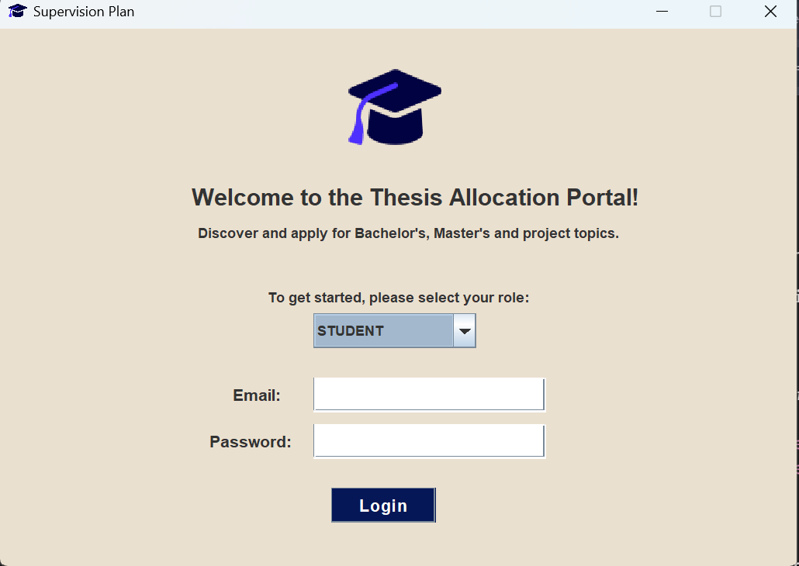
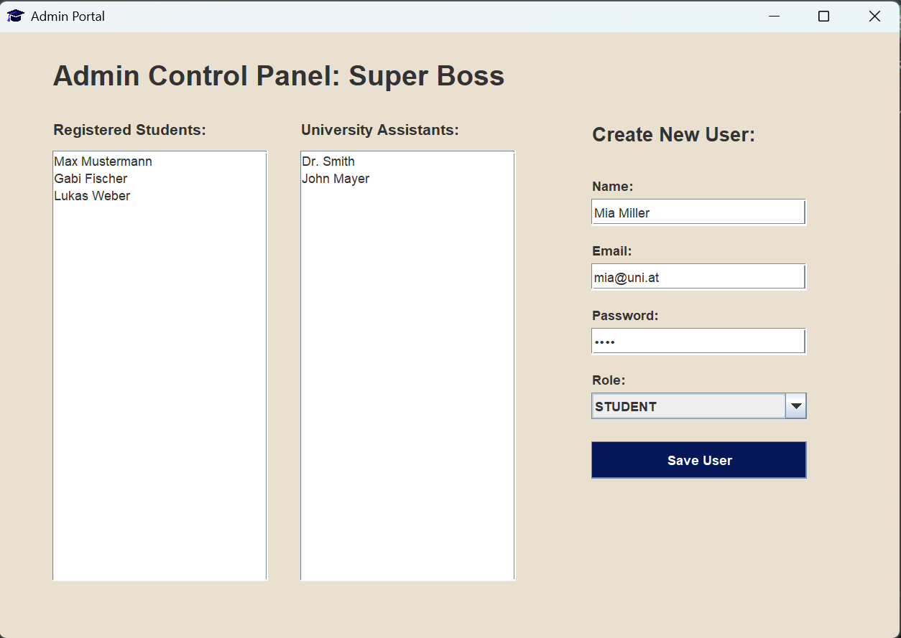
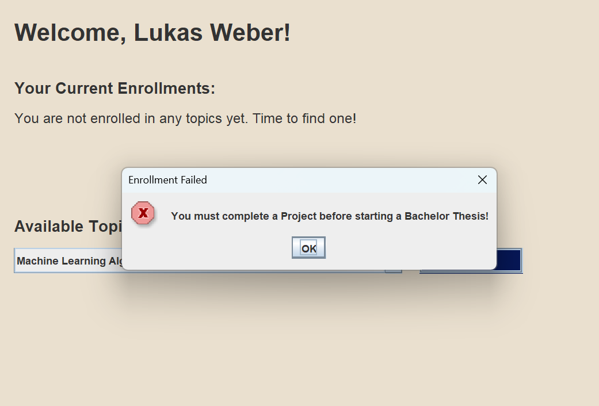

# Thesis Allocation Portal (Supervision Plan)

A Java Swing desktop application designed to manage university thesis and project allocations. Built with Java, Hibernate (ORM), and MySQL, this portal supports distinct roles for Students, University Assistants, and Administrators.

## 📸 Application Previews

*A visual overview of the portal's graphical user interface, showcasing the distinct dashboards and login portal:*





## 🚀 Features

*   **Role-Based Access Control:** Dedicated dashboards for Students, Assistants, and Admins.
*   **Administrator Control Panel:** Admins can view all registered users and create new accounts with specific roles.
*   **Assistant Dashboard:** University Assistants can create new Bachelor/Master theses or projects, view their currently supervised topics, and update their maximum student supervision limit.
*   **Student Portal:** Students can browse available topics, apply for them, and track their current enrollments. Includes validation to ensure students follow the correct progression (e.g., must complete a Project before a Bachelor Thesis). Only one student is allowed to enroll in any given topic.
*   **Database Integration:** Fully integrated with MySQL using Hibernate ORM for persistent data storage.

## 🛠️ Tech Stack

*   **Language:** Java
*   **GUI Framework:** Java Swing / AWT
*   **Database:** MySQL
*   **ORM:** Hibernate
*   **Tools:** IntelliJ IDEA, phpMyAdmin

## ⚙️ Setup and Installation

### 1. Database Configuration

1.  Open phpMyAdmin or your preferred MySQL client.
2.  Create a new database (e.g., `university_db`).
3.  Import the provided `university_db.sql` file to set up the tables and initial populated data.
4.  Open `src/hibernate.cfg.xml` and update the connection URL, username, and password to match your local MySQL configuration:
```xml
    <property name="connection.url">jdbc:mysql://localhost:3306/university_db</property>
    <property name="connection.username">your_username</property>
    <property name="connection.password">your_password</property>
```

### 2. Running the Application

1.  Clone this repository:
```bash
    git clone [https://github.com/YOUR-USERNAME/thesis-allocation-portal.git](https://github.com/YOUR-USERNAME/thesis-allocation-portal.git)
```
2.  Open the project in your IDE (IntelliJ IDEA recommended).
3.  Ensure the Hibernate libraries (`lib` folder) are added to your project structure/classpath.
4.  Run the `Application.java` file located in the `src` folder.

## 👥 Default Test Accounts

Because the database was exported with test data included, you can log in immediately using the following accounts to explore the different roles:

*   **Admin:** `admin@uni.at` | Password: `1234`
*   **Assistant:** `smith@uni.at` | Password: `1234`
*   **Student:** `max@uni.at` | Password: `1234`

## 📝 Author

**Viktoria Gospodinova**
*Semester 2 Object-Oriented Programming Project*
